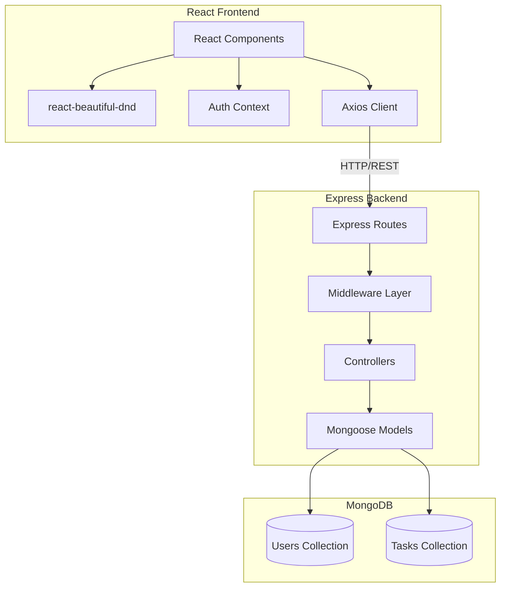
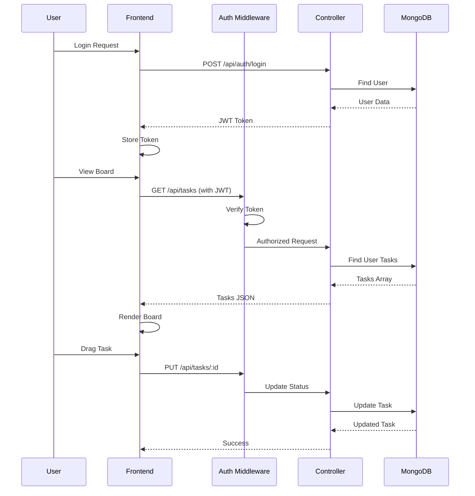

# Design Document: Kanban Task Board

## Overview

A full-stack Kanban task board application built with Node.js/Express backend and React frontend. The system provides user authentication via JWT, task management with CRUD operations, and a visual Kanban board with drag-and-drop functionality. MongoDB serves as the database with Mongoose ODM for data modeling.

## Architecture



### System Flow



## Components and Interfaces

### Backend Components

#### 1. Express Application (app.js)
- Entry point configuring middleware, routes, and error handling
- CORS enabled for frontend communication
- JSON body parsing
- Global error handler middleware

#### 2. Database Connection (config/db.js)
```javascript
// Interface: Database connector
async function connectDB(): Promise<void>
// Connects to MongoDB using MONGO_URI from environment
// Exits process on connection failure
```

#### 3. Authentication Middleware (middleware/auth.js)
```javascript
// Interface: JWT verification middleware
function authMiddleware(req, res, next): void
// Input: Authorization header with Bearer token
// Output: Sets req.user with decoded token payload
// Errors: 401 if no token or invalid token
```

#### 4. Validation Middleware (middleware/validate.js)
```javascript
// Interface: Request validation using Joi
function validate(schema): MiddlewareFunction
// Input: Joi schema object
// Output: Middleware that validates req.body
// Errors: 400 with field-level errors if validation fails
```

#### 5. Auth Controller (controllers/authController.js)
```javascript
// Interface: User authentication operations
async function signup(req, res): Response
// Input: { email, password, name }
// Output: { user, token }
// Errors: 400 validation, 409 duplicate email

async function login(req, res): Response
// Input: { email, password }
// Output: { user, token }
// Errors: 400 validation, 401 invalid credentials

async function getProfile(req, res): Response
// Input: req.user from auth middleware
// Output: { user } (without password)

async function updateProfile(req, res): Response
// Input: { name?, email?, password? }
// Output: { user } updated

async function deleteProfile(req, res): Response
// Input: req.user from auth middleware
// Output: { message: 'Account deleted' }
// Side effect: Deletes all user's tasks
```

#### 6. Task Controller (controllers/taskController.js)
```javascript
// Interface: Task CRUD operations
async function createTask(req, res): Response
// Input: { title, description?, status?, dueDate? }
// Output: { task } with created_at timestamp

async function getTasks(req, res): Response
// Input: req.query.status (optional filter)
// Output: { tasks: Task[] } belonging to user

async function getTaskById(req, res): Response
// Input: req.params.id
// Output: { task }
// Errors: 404 not found, 403 not owner

async function updateTask(req, res): Response
// Input: { title?, description?, status?, dueDate? }
// Output: { task } updated
// Errors: 404 not found, 403 not owner

async function deleteTask(req, res): Response
// Input: req.params.id
// Output: { message: 'Task deleted' }
// Errors: 404 not found, 403 not owner
```

### Frontend Components

#### 1. App Router (App.jsx)
- React Router configuration
- Protected route wrapper
- Auth context provider

#### 2. Auth Context (context/AuthContext.jsx)
```javascript
// Interface: Authentication state management
interface AuthContext {
  user: User | null;
  token: string | null;
  login(email, password): Promise<void>;
  signup(email, password, name): Promise<void>;
  logout(): void;
  updateProfile(data): Promise<void>;
  deleteAccount(): Promise<void>;
  isAuthenticated: boolean;
}
```

#### 3. API Client (services/api.js)
```javascript
// Interface: Axios instance with interceptors
const api = axios.create({ baseURL: '/api' });
// Interceptors: Add auth header, handle 401 redirects
```

#### 4. Task Service (services/taskService.js)
```javascript
// Interface: Task API operations
async function fetchTasks(status?): Promise<Task[]>
async function createTask(data): Promise<Task>
async function updateTask(id, data): Promise<Task>
async function deleteTask(id): Promise<void>
```

#### 5. KanbanBoard Component (components/KanbanBoard.jsx)
```javascript
// Interface: Main board with drag-and-drop
interface KanbanBoardProps {}
// State: tasks grouped by status
// Handlers: onDragEnd, optimistic updates with rollback
```

#### 6. Column Component (components/Column.jsx)
```javascript
// Interface: Droppable column
interface ColumnProps {
  status: 'pending' | 'in-progress' | 'completed';
  tasks: Task[];
  onAddTask(): void;
  onEditTask(task): void;
  onDeleteTask(id): void;
}
```

#### 7. TaskCard Component (components/TaskCard.jsx)
```javascript
// Interface: Draggable task card
interface TaskCardProps {
  task: Task;
  index: number;
  onEdit(): void;
  onDelete(): void;
}
// Displays: title, truncated description, formatted due date
```

#### 8. TaskModal Component (components/TaskModal.jsx)
```javascript
// Interface: Create/Edit task modal
interface TaskModalProps {
  isOpen: boolean;
  task?: Task;
  onClose(): void;
  onSave(data): void;
}
```

## Data Models

### User Model
```javascript
const UserSchema = {
  email: {
    type: String,
    required: true,
    unique: true,
    lowercase: true,
    trim: true
  },
  password: {
    type: String,
    required: true,
    minlength: 6
  },
  name: {
    type: String,
    required: true,
    trim: true
  }
};
// Timestamps: createdAt, updatedAt (auto)
// Methods: comparePassword(candidatePassword)
// Pre-save hook: Hash password with bcrypt
```

### Task Model
```javascript
const TaskSchema = {
  userId: {
    type: ObjectId,
    ref: 'User',
    required: true,
    index: true
  },
  title: {
    type: String,
    required: true,
    trim: true,
    maxlength: 100
  },
  description: {
    type: String,
    trim: true,
    maxlength: 500
  },
  status: {
    type: String,
    enum: ['pending', 'in-progress', 'completed'],
    default: 'pending'
  },
  dueDate: {
    type: Date
  },
  created_at: {
    type: Date,
    default: Date.now
  }
};
// Index: { userId: 1, status: 1 } for filtered queries
```

### Validation Schemas (Joi)
```javascript
// Auth validation
const signupSchema = Joi.object({
  email: Joi.string().email().required(),
  password: Joi.string().min(6).required(),
  name: Joi.string().min(1).max(50).required()
});

const loginSchema = Joi.object({
  email: Joi.string().email().required(),
  password: Joi.string().required()
});

// Task validation
const createTaskSchema = Joi.object({
  title: Joi.string().min(1).max(100).required(),
  description: Joi.string().max(500).allow(''),
  status: Joi.string().valid('pending', 'in-progress', 'completed'),
  dueDate: Joi.date().iso().allow(null)
});

const updateTaskSchema = Joi.object({
  title: Joi.string().min(1).max(100),
  description: Joi.string().max(500).allow(''),
  status: Joi.string().valid('pending', 'in-progress', 'completed'),
  dueDate: Joi.date().iso().allow(null)
}).min(1);
```

## API Routes

### Authentication Routes
| Method | Endpoint | Description | Auth |
|--------|----------|-------------|------|
| POST | /api/auth/signup | Register new user | No |
| POST | /api/auth/login | Login user | No |
| GET | /api/auth/profile | Get current user profile | Yes |
| PUT | /api/auth/profile | Update user profile | Yes |
| DELETE | /api/auth/profile | Delete user account | Yes |

### Task Routes
| Method | Endpoint | Description | Auth |
|--------|----------|-------------|------|
| POST | /api/tasks | Create new task | Yes |
| GET | /api/tasks | Get all user tasks | Yes |
| GET | /api/tasks?status=X | Get tasks filtered by status | Yes |
| GET | /api/tasks/:id | Get single task | Yes |
| PUT | /api/tasks/:id | Update task | Yes |
| DELETE | /api/tasks/:id | Delete task | Yes |


## Correctness Properties

*A property is a characteristic or behavior that should hold true across all valid executions of a system—essentially, a formal statement about what the system should do. Properties serve as the bridge between human-readable specifications and machine-verifiable correctness guarantees.*

### Property 1: Password Hashing
*For any* user registration with a valid password, the stored password in the database SHALL NOT equal the plaintext password provided during registration.
**Validates: Requirements 1.4**

### Property 2: Registration Validation
*For any* registration request with invalid data (missing required fields, malformed email, password less than 6 characters), the System SHALL reject the request with a 400 status and field-specific error messages.
**Validates: Requirements 1.3**

### Property 3: Duplicate Email Rejection
*For any* email address that already exists in the database, a registration attempt with that email SHALL be rejected with a 409 status code.
**Validates: Requirements 1.2**

### Property 4: Authentication Token Generation
*For any* valid registration or login request, the System SHALL return a valid JWT token that can be used to access protected routes.
**Validates: Requirements 1.1, 2.1**

### Property 5: Invalid Credentials Rejection
*For any* login attempt with incorrect email or password, the System SHALL return a 401 status code without revealing which field was incorrect.
**Validates: Requirements 2.2**

### Property 6: Protected Route Enforcement
*For any* request to a protected endpoint without a valid JWT token, the System SHALL return a 401 Unauthorized status.
**Validates: Requirements 2.4**

### Property 7: Profile Data Excludes Password
*For any* profile retrieval request, the response SHALL contain user data (id, email, name) but SHALL NOT contain the password field.
**Validates: Requirements 3.1**

### Property 8: Profile Update Persistence
*For any* valid profile update request, the returned profile data SHALL reflect all submitted changes.
**Validates: Requirements 3.2**

### Property 9: Account Deletion Cascade
*For any* account deletion request, the System SHALL delete the user AND all tasks associated with that user's ID.
**Validates: Requirements 3.3**

### Property 10: Task Creation with Timestamp
*For any* valid task creation request, the created task SHALL have a created_at timestamp within 5 seconds of the request time.
**Validates: Requirements 4.1, 4.2**

### Property 11: Task Validation
*For any* task creation or update request with invalid data (missing title, title exceeding 100 chars, description exceeding 500 chars), the System SHALL reject with a 400 status and field-specific errors.
**Validates: Requirements 4.3, 6.4**

### Property 12: Status Enum Enforcement
*For any* task creation or update request with a status value not in ["pending", "in-progress", "completed"], the System SHALL reject the request with a validation error.
**Validates: Requirements 4.4**

### Property 13: User Task Isolation
*For any* authenticated user requesting their tasks, the response SHALL contain ONLY tasks where userId matches the authenticated user's ID.
**Validates: Requirements 5.1**

### Property 14: Status Filter Accuracy
*For any* task retrieval request with a status filter, ALL returned tasks SHALL have a status matching the filter value.
**Validates: Requirements 5.2**

### Property 15: Task Ownership Enforcement
*For any* task operation (get, update, delete) on a task not owned by the authenticated user, the System SHALL return 403 Forbidden (or 404 for security through obscurity).
**Validates: Requirements 5.4, 6.3, 7.2**

### Property 16: Task Update Persistence
*For any* valid task update request on an owned task, the returned task data SHALL reflect all submitted changes including status.
**Validates: Requirements 6.1, 6.2**

### Property 17: Task Deletion Verification
*For any* successful task deletion, subsequent retrieval of that task ID SHALL return 404 Not Found.
**Validates: Requirements 7.1, 7.3**

### Property 18: Board Column-Status Mapping
*For any* set of tasks displayed on the board, each task card SHALL appear in the column corresponding to its status value.
**Validates: Requirements 8.2**

### Property 19: Drag-Drop Status Persistence
*For any* successful drag-and-drop operation moving a task to a different column, the task's status in the database SHALL match the target column's status.
**Validates: Requirements 9.1, 9.2**

### Property 20: Drag-Drop Rollback on Error
*For any* drag-and-drop operation where the API call fails, the task card SHALL return to its original column position.
**Validates: Requirements 9.3**

### Property 21: Validation Error Format
*For any* validation failure, the error response SHALL include an array of field-specific error objects with field name and error message.
**Validates: Requirements 11.2**

## Error Handling

### Backend Error Handling

#### HTTP Status Codes
| Code | Usage |
|------|-------|
| 200 | Successful GET, PUT, DELETE |
| 201 | Successful POST (resource created) |
| 400 | Validation errors, malformed requests |
| 401 | Missing or invalid authentication |
| 403 | Forbidden (accessing others' resources) |
| 404 | Resource not found |
| 409 | Conflict (duplicate email) |
| 500 | Internal server error |

#### Error Response Format
```javascript
// Validation errors
{
  "error": "Validation failed",
  "details": [
    { "field": "email", "message": "Invalid email format" },
    { "field": "password", "message": "Password must be at least 6 characters" }
  ]
}

// General errors
{
  "error": "Resource not found"
}
```

#### Global Error Middleware
```javascript
function errorHandler(err, req, res, next) {
  console.error(err.stack);
  
  if (err.name === 'ValidationError') {
    return res.status(400).json({
      error: 'Validation failed',
      details: formatValidationErrors(err)
    });
  }
  
  if (err.name === 'UnauthorizedError') {
    return res.status(401).json({ error: 'Invalid token' });
  }
  
  res.status(500).json({ error: 'Internal server error' });
}
```

### Frontend Error Handling

#### API Error Interceptor
```javascript
api.interceptors.response.use(
  response => response,
  error => {
    if (error.response?.status === 401) {
      // Clear auth and redirect to login
      authContext.logout();
    }
    return Promise.reject(error);
  }
);
```

#### Toast Notifications
- Success: Green toast for successful operations
- Error: Red toast with user-friendly message
- Network Error: "Unable to connect. Please check your connection."

#### Optimistic Update Rollback
```javascript
async function handleDragEnd(result) {
  const { source, destination, draggableId } = result;
  if (!destination) return;
  
  // Optimistic update
  const previousTasks = { ...tasks };
  updateLocalState(draggableId, destination.droppableId);
  
  try {
    await taskService.updateTask(draggableId, { 
      status: destination.droppableId 
    });
  } catch (error) {
    // Rollback on failure
    setTasks(previousTasks);
    toast.error('Failed to update task status');
  }
}
```

## Testing Strategy

### Testing Approach

This project uses a dual testing approach:
1. **Unit Tests**: Verify specific examples, edge cases, and error conditions
2. **Property-Based Tests**: Verify universal properties across many generated inputs

Both are complementary—unit tests catch concrete bugs while property tests verify general correctness.

### Backend Testing

#### Framework: Jest + Supertest
```bash
npm install --save-dev jest supertest @faker-js/faker fast-check
```

#### Test Structure
```
backend/
├── __tests__/
│   ├── unit/
│   │   ├── models/
│   │   │   ├── user.test.js
│   │   │   └── task.test.js
│   │   └── middleware/
│   │       └── auth.test.js
│   ├── integration/
│   │   ├── auth.test.js
│   │   └── tasks.test.js
│   └── properties/
│       ├── auth.property.test.js
│       └── tasks.property.test.js
```

#### Property-Based Testing with fast-check
```javascript
// Example: Property 13 - User Task Isolation
const fc = require('fast-check');

describe('Property 13: User Task Isolation', () => {
  // Feature: kanban-task-board, Property 13: User Task Isolation
  // Validates: Requirements 5.1
  it('should return only tasks belonging to authenticated user', async () => {
    await fc.assert(
      fc.asyncProperty(
        fc.array(taskArbitrary, { minLength: 1, maxLength: 10 }),
        async (tasks) => {
          // Create tasks for user
          const createdTasks = await Promise.all(
            tasks.map(t => createTaskForUser(user1, t))
          );
          
          // Fetch as user1
          const response = await request(app)
            .get('/api/tasks')
            .set('Authorization', `Bearer ${user1Token}`);
          
          // All returned tasks should belong to user1
          return response.body.tasks.every(
            task => task.userId === user1.id
          );
        }
      ),
      { numRuns: 100 }
    );
  });
});
```

### Frontend Testing

#### Framework: Vitest + React Testing Library
```bash
npm install --save-dev vitest @testing-library/react @testing-library/jest-dom jsdom fast-check
```

#### Test Structure
```
frontend/
├── src/
│   ├── components/
│   │   ├── __tests__/
│   │   │   ├── KanbanBoard.test.jsx
│   │   │   ├── TaskCard.test.jsx
│   │   │   └── Column.test.jsx
│   ├── context/
│   │   └── __tests__/
│   │       └── AuthContext.test.jsx
│   └── services/
│       └── __tests__/
│           └── taskService.test.js
```

### Test Configuration

#### Jest Config (backend)
```javascript
// jest.config.js
module.exports = {
  testEnvironment: 'node',
  setupFilesAfterEnv: ['./jest.setup.js'],
  testMatch: ['**/__tests__/**/*.test.js'],
  collectCoverageFrom: ['src/**/*.js'],
  coverageThreshold: {
    global: { branches: 70, functions: 70, lines: 70 }
  }
};
```

#### Vitest Config (frontend)
```javascript
// vitest.config.js
import { defineConfig } from 'vitest/config';
import react from '@vitejs/plugin-react';

export default defineConfig({
  plugins: [react()],
  test: {
    environment: 'jsdom',
    setupFiles: './src/test/setup.js',
    globals: true
  }
});
```

### Property Test Annotations

Each property test MUST include a comment referencing the design property:
```javascript
// Feature: kanban-task-board, Property {N}: {Property Title}
// Validates: Requirements X.Y
```

Property tests should run minimum 100 iterations to ensure adequate coverage.
