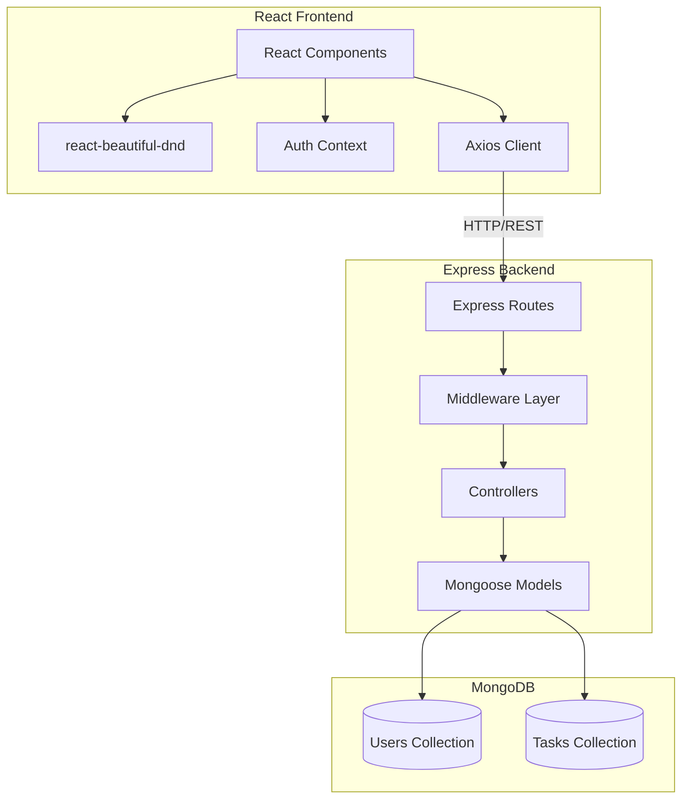

# Kanban Task Board - System Design

## Overview

This document outlines the initial system design for the Kanban Task Board application. The design tackles the project requirements through a modern full-stack architecture using Node.js/Express for the backend, React for the frontend, and MongoDB for data persistence. The system emphasizes clean code architecture, security, and user experience.

## Architecture Overview



## Technology Stack

### Backend Technologies
- **Framework**: Node.js with Express.js
- **Database**: MongoDB with Mongoose ODM
- **Authentication**: JWT (JSON Web Tokens)
- **Validation**: Joi for input validation
- **Security**: bcrypt for password hashing
- **Environment**: dotenv for configuration

### Frontend Technologies
- **Framework**: React.js with functional components
- **Styling**: Tailwind CSS for responsive design
- **Drag & Drop**: react-beautiful-dnd library
- **HTTP Client**: Axios with interceptors
- **Routing**: React Router for navigation
- **State Management**: React Context API

## System Components

### Backend Architecture

#### 1. Express Application Structure
```
backend/
├── app.js              # Main application entry point
├── config/
│   └── db.js          # Database connection
├── controllers/
│   ├── authController.js
│   └── taskController.js
├── middleware/
│   ├── auth.js        # JWT verification
│   └── validate.js    # Input validation
├── models/
│   ├── User.js        # User schema
│   └── Task.js        # Task schema
└── routes/
    ├── auth.js        # Authentication routes
    └── tasks.js       # Task management routes
```

#### 2. Data Models

**User Model**:
```javascript
{
  email: String (required, unique, lowercase)
  password: String (required, hashed)
  name: String (required)
  createdAt: Date (auto)
  updatedAt: Date (auto)
}
```

**Task Model**:
```javascript
{
  userId: ObjectId (required, indexed)
  title: String (required, max 100 chars)
  description: String (optional, max 500 chars)
  status: Enum ['pending', 'in-progress', 'completed']
  dueDate: Date (optional)
  created_at: Date (auto)
}
```

#### 3. API Endpoints Design

**Authentication Routes**:
- `POST /api/auth/signup` - User registration
- `POST /api/auth/login` - User authentication
- `GET /api/auth/profile` - Get user profile
- `PUT /api/auth/profile` - Update user profile
- `DELETE /api/auth/profile` - Delete user account

**Task Management Routes**:
- `POST /api/tasks` - Create new task
- `GET /api/tasks` - Get user tasks (with optional status filter)
- `GET /api/tasks/:id` - Get specific task
- `PUT /api/tasks/:id` - Update task
- `DELETE /api/tasks/:id` - Delete task

### Frontend Architecture

#### 1. Component Structure
```
frontend/src/
├── components/
│   ├── KanbanBoard.jsx    # Main board component
│   ├── Column.jsx         # Individual column
│   ├── TaskCard.jsx       # Task card component
│   ├── TaskModal.jsx      # Create/edit modal
│   └── common/
│       ├── Header.jsx
│       └── ProtectedRoute.jsx
├── pages/
│   ├── Login.jsx
│   ├── Signup.jsx
│   ├── Dashboard.jsx
│   └── Profile.jsx
├── context/
│   └── AuthContext.jsx    # Authentication state
├── services/
│   ├── api.js            # Axios configuration
│   └── taskService.js    # Task API calls
└── utils/
    └── helpers.js        # Utility functions
```

#### 2. State Management Strategy
- **Authentication State**: React Context for user session
- **Task State**: Local component state with API synchronization
- **UI State**: Component-level state for modals, loading states
- **Optimistic Updates**: Immediate UI updates with API rollback on errors

## Security Design

### Authentication Flow
1. User submits credentials
2. Server validates and returns JWT token
3. Client stores token in memory/localStorage
4. Token included in API requests via Authorization header
5. Server validates token on protected routes

### Security Measures
- Password hashing with bcrypt (salt rounds: 12)
- JWT tokens with expiration
- Input validation and sanitization
- User data isolation (tasks filtered by userId)
- CORS configuration for frontend domain
- Environment variables for sensitive data

## User Experience Design

### Kanban Board Interface
- **Three Columns**: Pending, In Progress, Completed
- **Task Cards**: Display title, truncated description, due date
- **Drag & Drop**: Smooth transitions with visual feedback
- **Responsive Design**: Mobile-first approach
- **Loading States**: Skeleton loaders during API calls

### Error Handling Strategy
- **Backend**: Structured error responses with HTTP status codes
- **Frontend**: Toast notifications for user feedback
- **Validation**: Real-time form validation
- **Network Errors**: Retry mechanisms and offline indicators

## Performance Considerations

### Backend Optimizations
- Database indexing on userId and status fields
- Pagination for large task lists
- Request rate limiting
- Efficient query patterns with Mongoose

### Frontend Optimizations
- Component memoization for expensive renders
- Lazy loading for route components
- Optimistic updates for better perceived performance
- Debounced search and filter operations

## Development Workflow

### Code Organization Principles
- **Separation of Concerns**: Clear boundaries between layers
- **Reusable Components**: Modular frontend components
- **Error Boundaries**: Graceful error handling
- **Consistent Naming**: Clear, descriptive variable/function names
- **Documentation**: Inline comments for complex logic

### Testing Strategy
- **Unit Tests**: Individual component and function testing
- **Integration Tests**: API endpoint testing
- **End-to-End Tests**: Critical user flow validation
- **Property-Based Tests**: Universal behavior verification

## Deployment Architecture

### Environment Configuration
- **Development**: Local MongoDB, hot reloading
- **Production**: MongoDB Atlas, optimized builds
- **Environment Variables**: Database URLs, JWT secrets, API keys

### Deployment Strategy
- **Frontend**: Static hosting (Vercel/Netlify)
- **Backend**: Container deployment (Render/Railway)
- **Database**: MongoDB Atlas cloud hosting
- **CI/CD**: Automated testing and deployment pipelines

## Future Enhancements

### Phase 2 Features
- Task categories and labels
- Due date notifications
- Bulk task operations
- Advanced filtering and search

### Scalability Considerations
- Microservices architecture for larger scale
- Caching layer (Redis) for frequently accessed data
- CDN for static assets
- Database sharding for user data

## Risk Mitigation

### Technical Risks
- **Database Failures**: Backup and recovery procedures
- **Authentication Issues**: Token refresh mechanisms
- **Performance Bottlenecks**: Monitoring and optimization
- **Security Vulnerabilities**: Regular dependency updates

### User Experience Risks
- **Data Loss**: Auto-save functionality
- **Offline Usage**: Service worker implementation
- **Browser Compatibility**: Progressive enhancement
- **Accessibility**: WCAG compliance considerations

---

This design document serves as the foundation for implementing a robust, scalable, and user-friendly Kanban task management system. The architecture emphasizes clean code practices, security, and maintainability while delivering an intuitive user experience.