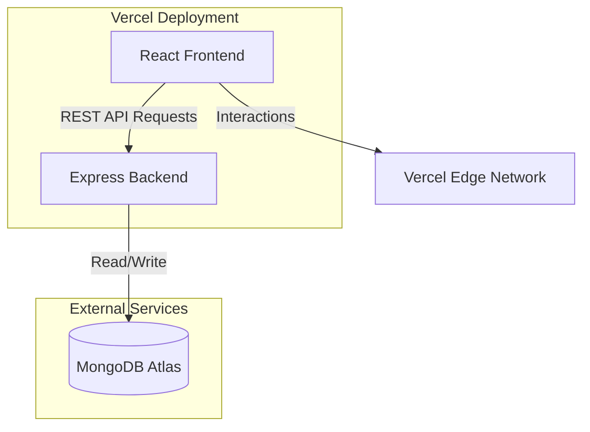

# 🌌 Kanban Flow - Cinematic Task Management System

**Kanban Flow** is a high-performance, aesthetically stunning task management application designed with a focus on deep work and fluidity. It features a custom "anti-gravity" glassmorphic UI, seamless drag-and-drop interactions, and a robust RESTful backend.

---

## 🎨 Design Philosophy
The UI is crafted to be "Awwwards-ready", breaking away from standard SaaS templates.
-   **Cinematic Dark Mode**: Pure near-black (`#050505`) canvas with ambient cyan glows.
-   **Glassmorphism**: Multi-layered, blurred interfaces using `backdrop-filter`.
-   **Anti-Gravity Motion**: Scroll-linked animations and floating text elements powered by **Framer Motion** and **HTML5 Canvas**.
-   **Fluidity**: Drag-and-drop tasks feel weightless yet physical.

## 🛠️ Tech Stack

### Frontend (Client)
-   **Framework**: [React](https://react.dev/) (Vite)
-   **Language**: TypeScript
-   **Styling**: [Tailwind CSS](https://tailwindcss.com/) (Custom Config)
-   **Animations**: [Framer Motion](https://www.framer.com/motion/) + HTML5 Canvas API
-   **State Management**: [TanStack Query](https://tanstack.com/query) (Server State)
-   **Drag & Drop**: `@hello-pangea/dnd`
-   **Icons**: [Lucide React](https://lucide.dev/)

### Backend (API)
-   **Runtime**: [Node.js](https://nodejs.org/)
-   **Framework**: [Express.js](https://expressjs.com/)
-   **Database**: [MongoDB Atlas](https://www.mongodb.com/atlas)
-   **ODM**: Mongoose
-   **Authentication**: JWT (JSON Web Tokens) & bcryptjs for security

### Infrastructure
-   **Hosting**: Vercel (Monorepo Deployment)
-   **CI/CD**: Git + Vercel Automatic Deployments

---

## 🏗️ Architecture

The application follows a modern **Client-Server Architecture** deployed as a monorepo.



## ✨ Key Features

1.  **Immersive Landing Page**:
    -   Scroll-driven storytelling with a 25-frame cinematic background animation.
    -   Floating "anti-gravity" typography.
    
2.  **Secure Authentication**:
    -   Glassmorphic Login/Register forms.
    -   JWT-based session management.
    
3.  **Interactive Kanban Board**:
    -   **Drag & Drop**: Move tasks smoothly between columns (Pending, In Progress, Completed).
    -   **Real-time Updates**: Optimistic UI updates powered by React Query.
    -   **Smart Indicators**: Visual cues for overdue tasks and priority.

4.  **Profile Management**:
    -   Update user details securely.
    -   "Danger Zone" for sensitive actions.

---

## ⚡ Local Development

To run this project locally:

1.  **Clone the repository**
    ```bash
    git clone https://github.com/guptashreyansh458/ShreyanshGupta_BTECH-10271-22.git
    cd ShreyanshGupta_BTECH-10271-22
    ```

2.  **Install Dependencies**
    ```bash
    # Install backend dependencies
    cd backend
    npm install
    
    # Install frontend dependencies
    cd ../frontend
    npm install
    ```

3.  **Environment Setup**
    Create `.env` files in both `backend` and `frontend` directories.
    
    *backend/.env*:
    ```env
    PORT=5000
    MONGODB_URI=your_mongodb_connection_string
    JWT_SECRET=your_secret_key
    FRONTEND_URL=http://localhost:3000
    ```

4.  **Run Locally**
    ```bash
    # Terminal 1: Backend
    cd backend
    npm run dev
    
    # Terminal 2: Frontend
    cd frontend
    npm run dev
    ```

---

## 📝 Submission Details
**Developer**: Shreyansh Gupta
**Roll No**: 10271-22
**Course**: B.Tech

